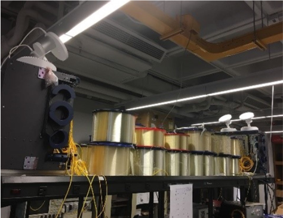
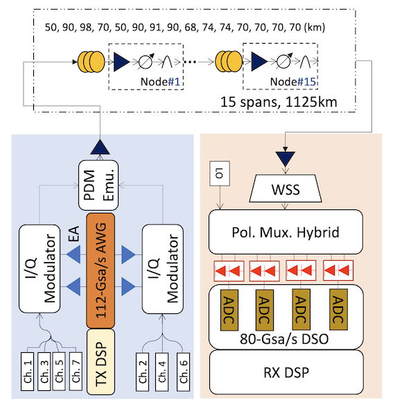

# LabPtPTm2

[![CC BY 4.0][cc-by-shield]][cc-by]
[](https://doi.org/10.6084/m9.figshare.14843037.v1)

1125km 7-channel DP-16QAM WDM transmission using quantum random bit source.
This dataset was collected in Jan 2021.

[dataloader](#data-apis) is the easiest method to access this dataset if you using Python

## Experimental Setup 

our experimental link


setup diagram



## Quantum random source
the transmitted quantum random source is generated through [quantumrand](https://pypi.org/project/quantumrand/),
which wraps [ANU's QRNG restful API](https://qrng.anu.edu.au/) 


## Access Data
### Install Data APIs
```
pip install https://github.com/remifan/labptptm2/archive/master.zip
```

### Usage
please refer to this [Instructions](examples/basics.ipynb)


## About this repo
this repo does not contain the data ifself but serves as its registry, the raw data is stored in AWS S3 remote.


## Citing

```
@dataset{qrfanlabptptm2,
  author    = {Qirui Fan and Chao Lu and Alan Pak Tao Lau},
  title     = {Dataset: 1125km 7-channel DP-16QAM WDM transmission using quantum random bit source},
  year      = {2021},
  month     = "6",
  url       = "https://github.com/remifan/LabPtPTm2"
  doi       = {10.6084/m9.figshare.14843037},
  publisher = {Figshare},
}
```

## Acknowledgements

thanks to ANU's [QRNG web service](https://qrng.anu.edu.au/)


## License

This work is licensed under a
[Creative Commons Attribution 4.0 International License][cc-by].

[![CC BY 4.0][cc-by-image]][cc-by]

[cc-by]: http://creativecommons.org/licenses/by/4.0/
[cc-by-image]: https://i.creativecommons.org/l/by/4.0/88x31.png
[cc-by-shield]: https://img.shields.io/badge/License-CC%20BY%204.0-lightgrey.svg

